# Reto DAX_Visualizaciones

Este documento resume el desarrollo del informe de Power BI para el Reto DAX y Visualizaciones, incluyendo estructura, requisitos cumplidos, medidas utilizadas y evidencias visuales mediante pantallazos.

El objetivo es facilitar la revisión del proyecto y demostrar claramente cómo se ha implementado cada requisito solicitado.

## 🧩 1. Descripción del Proyecto

El informe consta de dos páginas principales:

Total Órdenes: análisis general de pedidos, ventas, devoluciones y distribución geográfica.

IA y Agrupaciones: análisis avanzado mediante IA, clústeres y agrupaciones automáticas.

Ambas páginas siguen la estructura de las plantillas proporcionadas, respetando la disposición de visuales y los elementos obligatorios del reto.

## 🖼️ 2. Pantallazos del Informe

A continuación se incluyen capturas de cada página del informe.

### 📄 Página: Total Órdenes
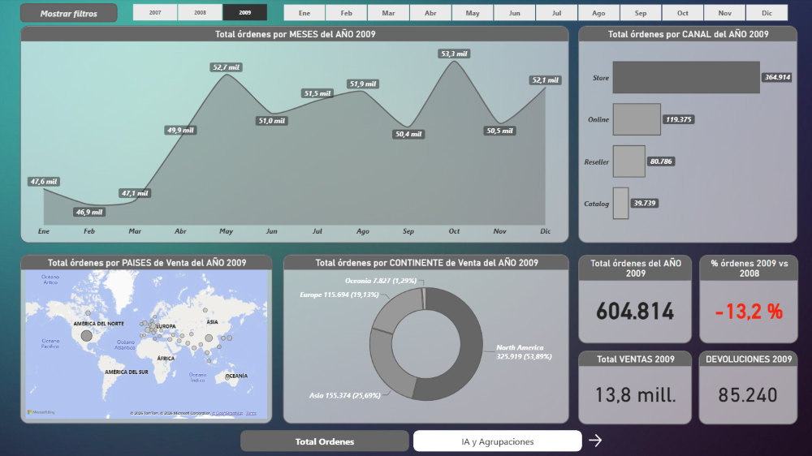

### 📄 Página: IA y Agrupaciones
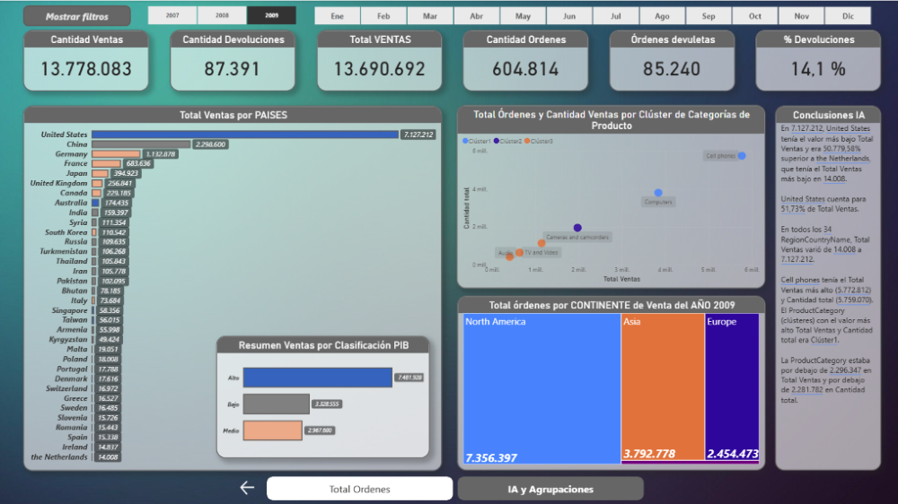

## ✔️ 3. Requisitos del Reto y Evidencias

Esta sección demuestra dónde se cumple cada requisito solicitado.

### 🔹 1. Estructura según plantilla

Se han replicado las dos páginas siguiendo la estructura de las plantillas:

Gráficos de líneas, barras, anillos y mapa.

KPIs superiores.

Segmentadores.

Navegación entre páginas.

Pantallazos de referencia:

### 📄 Plantilla Órdenes 
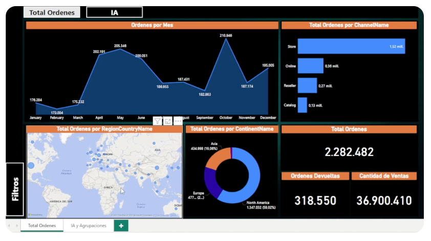

### 📄 Plantilla IA 
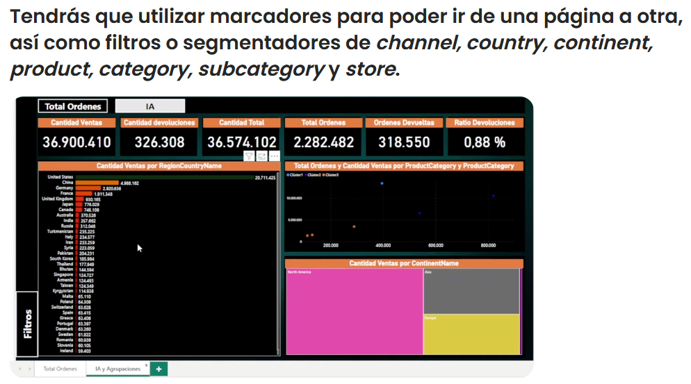

### 🔹 2. Formato condicional aplicado

### ✔ Títulos dinámicos

Los títulos de cada elemento de la página "Total Órdenes" cambian automáticamente según el año seleccionado en el segmentador.

#### 📄 Pantallazo Títulos dinámicos
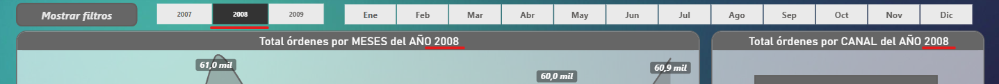  

### ✔ KPI con color condicional

El KPI de variación interanual cambia de color:

Rojo si el valor es negativo.

Azul si el valor es positivo.

#### 📄 Pantallazo KPI formato condicional 
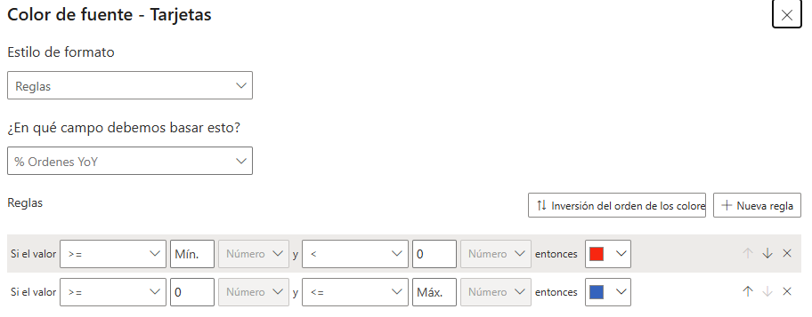

Si no hay filtros aplicados, el valor es negativo, y por tanto ROJO, pero si se filtra por AUDIO, el resultado es positivo y se muestra azul  

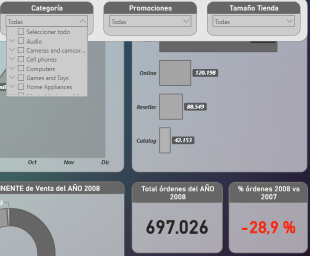
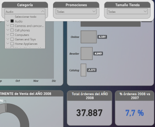

### 🔹 3. Segmentadores sincronizados

Los Segmentadores están sincronizados para que se apliquen en las dos páginas

#### 📄 Pantallazo Sincronización 
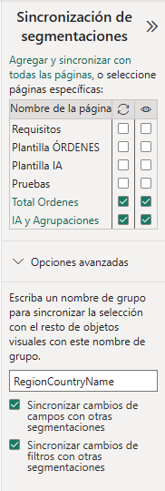

### 🔹 4. Marcadores y navegación entre páginas

Se han implementado botones de navegación que permiten cambiar entre "Total Órdenes" y "IA y Agrupaciones" además se ha añadido un botón en cada página que lleva a la anterior o posterior (cobrarían más sentido con más paginas) 

#### 📄 Pantallazo Navegación 

#### 📄 Pantallazo Marcadores
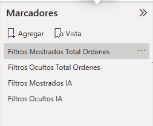

### 🔹 5. Visualizaciones de IA

La página de IA incluye:

Gráfico de dispersión con clústeres.

Texto de conclusiones generado automáticamente.

### 🔹 6. Agrupaciones / Clústeres

#### ⚡ Clústeres
Se han generado clústeres automáticos mediante IA:

Clúster 1

Clúster 2

Clúster 3

#### ⚡ Agrupaciones

Se han añadido al modelo los datos de PIB por habitante y con este dato, una agrupación: Alto, Medio y Bajo:  

Clasificación PIB = IF(
    PIB[PIB]>70000,"Alto",
    IF(PIB[PIB]>30000,"Medio","Bajo"
    ))

Y se ha utilizado en esta visualización:

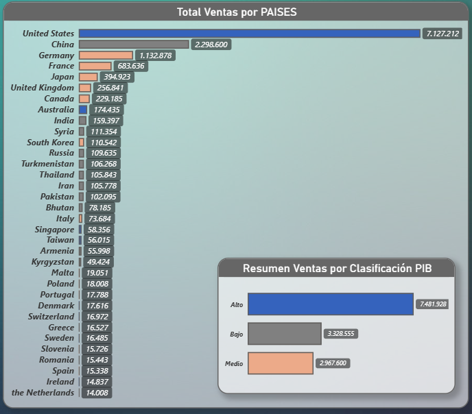 

## 🧮 4. Medidas DAX Utilizadas

A continuación se listan algunas de las medidas clave utilizadas en el informe.

### 📌 Títulos dinámicos

Titulo Continente = "Total órdenes por CONTINENTE de Venta del AÑO " & SELECTEDVALUE('DimCalendar'[Año])

Titulo Canal = "Total órdenes por CANAL del AÑO " & Format(max(DimCalendar[DateKey]),"YYYY")

Titulo % VS aa =  
    VAR Actual = max(DimCalendar[DateKey])  
    VAR Anterior = DATE(YEAR(Actual)-1, Month(Actual),1)  
    RETURN "% órdenes " & Year(Actual) &" vs " & year(Anterior)

### 📌 Variación órdenes vs año anterior

% Ordenes YoY = 
	VAR OrdenesAA =  
    		CALCULATE(  
                	[Total Ordenes],
                    	DATEADD('DimCalendar'[DateKey], -1, YEAR)  
                        	)  
    RETURN  
          	DIVIDE([Total Ordenes] - OrdenesAA, OrdenesAA)

## 📈 5. Conclusiones del Informe

Los clústeres permiten identificar patrones de comportamiento entre países y categorías.

La IA destaca diferencias claras entre grupos de alto y bajo rendimiento.

La página de Órdenes muestra tendencias estacionales y diferencias entre canales.

El formato condicional facilita la interpretación rápida de KPIs.

## 📦 6. Archivos Incluidos en el Repositorio

/Reto+Visualizaciones.pbix – Archivo principal del informe.

/README.md – Este documento.

/img/ – Carpeta con pantallazos.

/plantillas/ – Plantillas originales.

## 🏁 7. Estado del Proyecto

Todos los requisitos del reto han sido cumplidos.

Este README sirve como evidencia completa para la evaluación del informe.

## ✨ 8. Autor

Sergio Molinero Canal– Proyecto Power BI, Reto DAX y Visualizaciones.